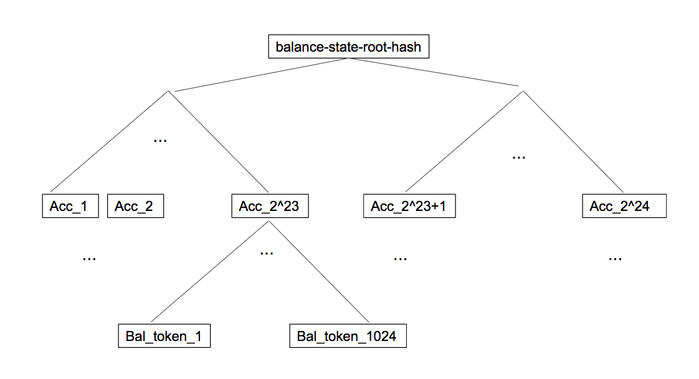
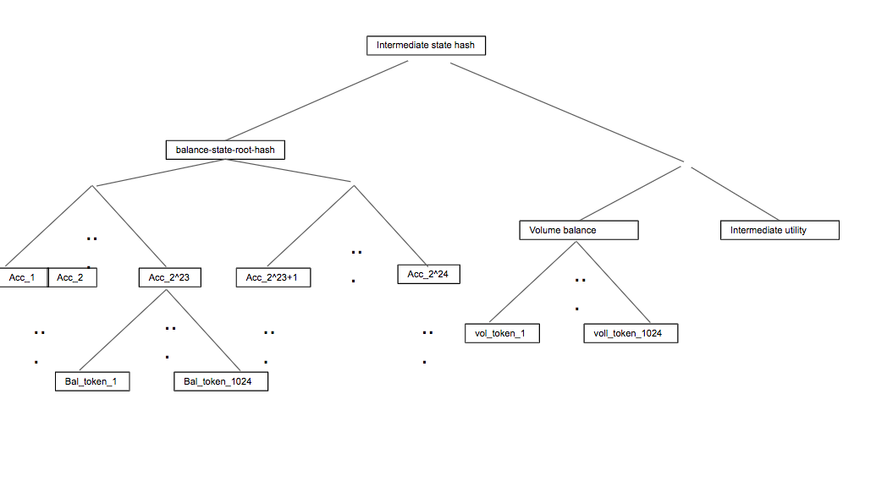

=================================================
dFusion - Decentralized Scalable Onchain Exchange
=================================================

.. contents::

A specification developed by Gnosis.

The following specification describes a scalable fully decentralized exchange with decentralized order matching. 
Scalability is achieved by storing only hashed information onchain and allowing any bonded party to propose state-transitions.
Predefined on-chain verification smart contracts allow any client to generate fraud proofs and thereby revert invalid state transitions.

Orders are matched in a batch auction with an arbitrage-free price clearing technique developed by Gnosis: `Uniform Clearing Prices <https://github.com/gnosis/dex-research/blob/master/BatchAuctionOptimization/batchauctions.pdf>`_.

Summary
=======

The envisioned exchange will enable **K** (in the magnitue of 2**24) accounts to trade via limit orders between **T** (in the magnitude of 2**10) predefined ERC20 tokens.
Limit orders are collected onchain in an orderstream and subsets of these orders are matched in batches, with each batch containing up to **M** (in the magnitude of 2**10) orders. 
Orders within a batch can be matched directly (e.g. an order trading token A for B against another order trading token B for A) or in arbitrarily long "ringtrades" (e.g. an order trading token A for B, with another one trading token B for C, with a third one trading token C for A).

The matching process is decentralized.
After orders have been collected over at least a certain amount of time, a batch is frozen and any sufficiently bonded participant can suggest a matching of orders in the current batch.

If more than one solution is submitted within a certain amount of time after the batch closes, the one that generates the largest "trader utility" (detailed explanation below, for now think "trading volume") is selected and executed.
For this, the party whose solution proposal was selected must post sufficient information on-chain, so that other participants can quickly validate.

Anyone can point out incorrect solutions on-chain within the so called _finalization_ period .
Within this finalization period, callouts are facilitated via so called fraud proofs.
For any non-satisfied constraints of a solution (specified in detail below), a specific fraud proof can be generated and the fraud can be validated onchain.

Due to the nature of fraud proofs, the system sets a crypto-economic incentive to only post valid solutions.

State stored in the smart contract
==================================

For each account, ERC20 token balance are merklized in a Merkle tree with the sha-hash operation in the anchor smart contract.
This "compressed" representation of all account balances is collision resistant and can thus be used to uniquely commit to the complete "uncompressed" state containing all balances explicitly. 
The "uncompressed" state will be stored off-chain and all state transitions will be announced via smart contract events. 
Thus, the full state will be fully reproducible for any participant by replaying all blocks since the creation of the smart contract. 
The following diagram shows how the "compressed" state hash is constructed:

To allow **K** to be small, a bi-map of an accounts public key (on-chain address) to its **accountId** will be stored in the anchor contract as well. 
The account index can be used to locate a users token balances in the state.

Furthermore, we store a bi-map of token address to its index **0 <= t <= T**, for each token that can be traded on the exchange.
When specifying tokens inside orders, deposits and withdrawel requests, we use the token's index **0 <= t <= T** instead of the full address.

As limit orders and deposits and withdrawal requests are collected they are not directly stored in the smart contract.
Doing so would require a **SSTORE** EVM instruction for each item.
This would be too gas-expensive. Instead the smart contract emits a smart contract event containing the relevant order information (account_id, from_token, to_token, buy_Amount, sell_Amount) and stores a rolling SHA hash.
For a new order, the rolling hash is computed by hashing the previous rolling hash with the current order.
Only after **O** orders are hashed via this rolling hash, the smart contract saves an ordercheckpoint hash, which is the current rolling hash.
Storing ordercheckpoints allows to quickly lookup orders for later verification processes.

Any participants can apply pending deposit and withdrawal requests to the current account balance state.
To do so, they provide a new state commitment that represents all account balances after the application of pending requests.
Moreover, as the new state is stored on the smart contract, pending requests are not reseted directly, only after a longer finalization period.

When a party applies withdrawal requests to the account balance state, they also provide the list of valid withdraws (in form of their Merkle root) which we store in the smart contract inside a mapping (**transitionId** -> **valid withdraw Merkle root**).
Participants can later claim their withdraw by providing a merkle inclusion proof of their withdraw in any of the "valid withdraw merkle-roots".
This will transfer their tokens from the smart contract's into their public address.
In order to avoid double withdraws, we also store a bitmap for each "withdraw merkle-root".
Each bit in that maps denotes if the withdraw has alreay been claimed.

Participants can provide state transitions that apply pending deposits and withdrawals only while the order collection process is ongoing (the current batch is not yet frozen).
Since price finding and order matching is a computationally expensive task, the account state must not change while the optimization problem is ongoing, as this could potentially invalidate correct solutions (e.g. a withdraw could lead to insufficient balance for a matched trade).
As soon as the matching of a closed batch is applied, pending withdrawls and deposits can again be applied to the state.

*// TODO state for snark challenge/response, e.g. hashBatchInfo*

To summarize, here is a list of state that is stored inside the smart contract:
- Merkle-root-state-hash of all token balances 
- Bi-Map of accounts public keys (ethereum addresses) to dƒusion accountId
- Bi-Map of ERC20 token addresses to internal dƒusion tokenId that the exchange supports
- Several rolling hash of pending orders, withdrawls and deposit requests (SHA)
- Map of stateTransitionId to pair of "valid withdrawel requests merkle-root" (SHA) and bitmap of already claimed withdraws
- Current state of the batch auction (e.g. *price-finding* vs. *order-collection*)

Batch Auction Workflow
======================

The trading workflow consists of the following sequential processes:

0. Account opening, deposits & withdrawals
1. On-Chain order collection
2. Finding the batch price: optimization of batch trading utility (off-chain)
3. Verifying batch price and trade execution 
4. Restart with step 1

Account opening & token registration
------------------------------------

Registering accounts
~~~~~~~~~~~~~~~~~~~~
The contract specifies a constant number of accounts, **K**, that can be opened by anyone by providing an **accountId** such that **1 <= accountId <= K**. 
The account index is referred to interchangeably as the account ID.

Upon opening an account, the contract verifies that
    - there is no account currently occupying the requested index and
    - the sender does not currently occupy an account slot.

On the level of contract storage, these contraints imply a bijective mapping {1, 2, ..., K} <-> addresses.

Note that: Registering accounts by specified index (rather than incrementing) enables the possiblity for accounts to be closed and account slots to be made available.

Registering tokens
~~~~~~~~~~~~~~~~~~

Token registration is performed by token address.
Tokens are indexed incrementally (implying that they can never be removed) from 1 to **T** (the maximum number of allowed tokens).
Only the contract owner may register tokens by address.

**Note that** the contract does not verify the requested token address is actually that of an ERC20 token. This implies that security is enforced by permissions (i.e. only owner may register tokens).

Deposits & Withdrawals
----------------------

Depositing token
~~~~~~~~~~~~~~~~

Deposits are requested by token index and amount. The contract verifies, that
    - the sender has registered an account,
    - the token index is that of a valid registered token and
    - the sender has sufficient balance

Token transfers (from sender to contract) are made during the deposit request phase, but the sender's balance is not represented in the **stateRoot** until these requests have been processed.

Sender may not exit their balances until the stateRoot has been updated with the appropriate deposit requests. However, any participant can process deposits. That is to say, an end user could potentially process their own deposits.

Upon successful transfer, the deposit is included in the appropriate depositRequest slot and the EVM emit's a "Deposit" event containing the following information
    - Account ID,
    - Token Index,
    - Amount Transferred,
    - Deposit Slot

Where, deposit slot is deterministically governed the EVM's current block number as the integer division of block number by 20. This allows for asynchronicity so that one knows (after a certain block) that the deposit hash is no longer **active** (i.e. will not change).
This is required for the asynchronous handling of in-flight transactions.

Processing Deposits
~~~~~~~~~~~~~~~~~~~

Deposits may be applied by specifying deposit slot and updated **stateRoot**. This new state root is computed by
- gathering all the deposit events for that slot,
- computing the updated balances for all cooresponding deposit transactions and
- computing the new Merkle-root-hash of all account balances

For security reasons, the **applyDeposits** function must be called with the following parameters
- slot,
- currentStateHash,
- newStateRoot

Although some aspects may not be entirely necessary, the contract verifies the following before updating the StateRoot;

- requested slot is strictly less than current deposit index. This ensures that deposit hash is no longer actively updated.
- requested deposits have not already been applied
- current stateRoot agrees with the one used in preocessing deposits.

Upon succefull validation for the state transition, the contract updates the new **stateRoot** with the proposed and emits and event of type applyDeposits along with both of the previous and new stateRoots respectively.

**Note that** stateRoots are stored in the contract as an array in preparation for the implementation of *roll backs*. That is, reserving the possibility to challenge successful state transisitions.

Exit Requests
~~~~~~~~~~~~~
TODO

Processing Exits
~~~~~~~~~~~~~~~~
TODO

Claiming Funds
~~~~~~~~~~~~~~

TODO

On-Chain order collection
-------------------------

All orders are encoded as limit sell orders: **(accountId, fromTokenIndex, toTokenIndex, buyAmount, sellAmount, validUntilAuctionId, flagIsBuy, flagIsCancelation, signature)**.
The order should be read in the following way: the user occupying the specified *accountId* would like to sell the token *fromTokenIndex* for *toTokenIndex* for at most the ratio *buyAmount* / *sellAmount*.
Additionally, the user would like to buy at most *buyAmount* tokens if the *flag_isBuy* is true, otherwise, he would like to sell at most *sellAmount* tokens.
Any placed order is placed into an order stream, a queue data type.
Any order in the orderstream is valid until the auction with the id *validUntilAuctionId* is reached or the order is popped out of the queue data, due to a new insert.
Additionally, an order can be resubmitted with the positive *flagIsCancelation* and then the order is also considered to be canceled. 
It does not matter, whether the cancelation order is before or after the actual order, in any case, the order is canceled.
If we would not have this logic, then anyone could just replay canceled orders.

The order stream is made up of last 2**24 placed orders or order cancelations.
The order stream is finite, as any solutions need to index orders with a certain amount of bits (24).
Orders in the order stream are batched into smaller batches of size 2**7, and for each of these batches, the rolling order hash is stored on-chain.
Each solution will just be able to consider the orders from the order stream stored in the last 2**(24-7) rolling order batches.

The *batchId* and *signature* allow a third party to submit an order on behalf of others (saving gas when batching multiple orders together).

The anchor smart contract on ethereum will offer the following function:

.. code:: js

    function appendOrders(bytes [] orders) { 
        // some preliminary checks limiting the number of orders..

        // update of orderHashSha
        for(i=0; i<orders.length; i++){
            if("check signature and batchID of order") {
                // hash order without signature
                byte32 oldHashSha = orderHashSha[orderBatchCount]
                orderHashSha[orderBatchCount] = Kecca256(oldHashSha, orders[i]) 
                emit OrderSubmitted(orders[i], orderHashSha[orderBatchCount])
                if(orderBatchCount % 2**7){
                    orderBatchCount++;
                }
            }
        }
    }

This function will update the rolling hash of pending orders, chaining all orders with a valid signature. 
This function is callable by any party. 
However, it is possible that “decentralized operators” accept orders from users, bundle them and then submit them all together in one function call. 

Notice, that the orders are only sent over as transaction payload, but will not be “stored” in the EVM (to save gas).
All relevant information is emitted as events.
This will allow any participant to reproduce all orders of the current batch by replaying the ethereum blocks since batch creation and filtering them for these events.

Also notice, the system allows orders, which might not be covered by any balance of the order sender. 
These orders will be sorted out later in the settlement of an auction. 
During the auction settlement, only a subset of the orderstream is actually considered and can be settled.

Any order once touched in a solution will also never be considered as a valid order, as we can not differeniate between intentially replayed orders and maliciously replayed ordres.

Finding the batch price: optimization of batch trading utility (off-chain)
--------------------------------------------------------------------------

After a certain time-frame, anyone can trigger a "batch-freeze" and the a snap-shot of the latest orderstream is made.
A new batch could immediately start collecting new orders while the previous one is being processed.
To process a batch, participants compute the uniform clearing price maximizing the trading utility between all trading pairs. 
The traders utility of an order is defined as the difference between the uniform clearning price and the limit price, multipied by the volume of the order with respect to some reference token. 
The exact procedure is described `here <https://github.com/gnosis/dex-research/blob/master/BatchAuctionOptimization/batchauctions.pdf>`_. 
Calculating the uniform clearing prices is an np-hard optimization problem and most likely the global optimum will not be found in the pre-defined short time frame of 3-10 minutes.
While we are unlikely to find a global optimum, the procedure is still fair, as everyone can submit their best solution.
However, many heuristic approaches might exist to find reasonable solutions in a short timeframe.

Since posting the complete solution (all prices and traded volumes) would be too gas expensive to put on-chain for each candidate solution, participants only submit the 'traders utility' they claim there solution is able to achieve and a bond.
The anchor contract will collect the best submissions for **C** minutes and will select the solution with the maximal 'traders utility' as the proposed solution. 
This proposed solution will become a - for the present being - a valid solution, if the solution submitter will load all details of his solution onchain within another **C/2** minutes.
If he does not do it, he will slashed and in the next **C/2** minutes anyone can submit another full solution and the best fully submitted solution will be accepted by the anchor contract.

This means the uniform clearing price of the auction is calculated in a permission-less decentralized way.  
Each time a solution is submitted to the anchor contract, the submitter also needs to bond themselves so that they can be penalized if their solutions later turns out incorrect.
The participant providing the winning solution will later also have to provide the updated account balances that result from applying their order matching.
In return for their efforts, solution providers will be rewarded with a fraction of transaction fees that are collected for each order.

Providing data for fraud proofs of solutions
--------------------------------------------------------------------------

The submitter of a solution needs to post the full solution into the ethereum chain as calldata payload. 
The payload will contain: (new balance state, prices, touched orders, trading volume per order, intermediate state hashes).
The solution is a new stateHash with the updated account balances, a price vector **P**:

=================  =================  =====  ================= 
 Index_0           Index_1            ...    Index_S
=================  =================  =====  =================
sizeVector(=S)     P_1, token_index   ...    P_S, token_index
=================  =================  =====  =================

of all prices relative to a reference token **Token_1** with token_index = 0.
The maximal size of the array is the total amount of tokens registed in the anchor contract.
Though it is expected that only a small fraction of tokens is actually touched and has a positive trading volume.
All tokens with a positive trading volume are required to be listed in the vector and have a well defined price.

Since prices are arbitrage-free, we can calculate the **price Token_i: Token_k** =  **(Token_i:Token_1):(Token_1:Token_k)**.
Each price is a 32-bit number and each token_index is a 10-bit number.

The touched orders is a vector of the following format:

=================  =================  =====  ================= 
 Index_0           Index_1            ...      Index_K
=================  =================  =====  =================
sizeVector(=K)     orderIndex_1       ...    orderIndex_K
=================  =================  =====  =================

The orderIndex is always referring to the orderIndex in the orderstream.
Since during the batch closing a snap-shot of the latest order batch is taken, we can refer to any order in the stream relative to that snap-shot.
The orderIndex 2**24 will reference to the last order in the batch.
And the orderIndex 0 will refere to the order submitted 2**24 order before the last one.
Each orderIndex is a 24 bit number.

The size of orders in the batch is bound by the amount of orders that we can verify on-chain within one fraud-proof.
Currently, the limit should be 1024 orders.
Solutons with any K< 2**10 can be valid solutions and maximizing the traders utility.

Along with the orders, the solution submitter also has to post a vector **V** of **buyVolumes** and **sellVolumes** for each order:

=========  =======  ===  =======
 V         order_1  ...  order_K  
=========  =======  ===  =======
buyVolume  o_1      ...  o_K
=========  =======  ===  =======
sellVolume  s_1      ...  s_K
=========  =======  ===  =======

Each Volume is a 32 bit float number.

Theoretically, it would be sufficient to provide only the **sellVolumes** and then caculate the **buyVolumes** from the prices. 
However, then rounding errors could happen, which will also effect the constraints of the optimization problem in unforseen ways and finding a solution generally becomes harder.
Hence, we provide both volumes.

Furthermore, for the feasibility of the fraud proofs, intermediate state-hashes need to be provided.
Intermediate state-hashes are a mixture of temporary variables for the order processing ( such as current trader utility and total buyVolume - sellVolume per token) and the intemediate state root hashes.

The number of intermediate hashes depends on the amount of orders in a solution. 
The exact number will be optimized at a later state, but roughly the number will be around _amount_of_orders_ / 5 .

The new state is optimistically assumed correct and only fraud proofs can invalidate them. 
All data is provided as data payload to the anchor contract which will hash them together into **hashBatchInfo** (which is also stored as transition metadata).
With this hash the solution is unambiguously "committed" on-chain with a minimum amount of gas.
If someone challenges the solution later, the smart contract can verify that a proof is for this particular solution by requiring that the private inputs to the proof hash to the values stored metadata.

The full uncompressed solution is also emitted as a smart contract event so that everyone can check whether the provided solution is actually a valid one. 

Fraud-Proofs for auction settlements
====================================

There are a variety of fraud-proofs:

State Transition & Utility & Conservation of value updates 
---------------------------------------------------------
- Reprovide the solution as payload
- For each order processed, verify the order from orderstream by reconstructing the stored order rolling hash of the referenced batch
- Verify hashed volume calldata matches committed volume hash of solution
- For each volume:
- Find the account + buy and sell token balance of the order belonging to this volume
- verify merkle path of buy token balance to current state root
- add buy volume to buy token balance
- recompute intermediate-state-root with updated buy token leaf
- update the trader's utility and token volumes according to the trade
- recompute intermediate-state-root with updated token volume leaf and trader's utility
- do the same for sell token balance (but subtract sell volume)
- Check that resulting hash is equal to newAccountRootHash of the solution.

State Transition
----------------
- verify via a merkle proof that the last intermediate-state-root does not hold the the claimed new-balance-state-root

Utility
-------
- verify via a merkle proof that hte last intermediate-state-root does not hold the claimed utility

Conservation of value
---------------------
- verify via a merkle proof of the last intermediate-state-hash has a non-valid conservation of value
(meaning that the | buyVolumes - Sellvolumes | > /eplsion )

Negative Account Balance
------------------------
- Provide merkle proof to account balance including it's value as calldata
- verify merkle proof results in newAccountRootHash of the solution
- check value < 0

Prices Coherence
----------------
- Provide volumes, prices and orders as well as index of order that is bad as calldata
- Verify order/volume/price calldata hash matches solution's order/volume/price hash
- Check at index if buyVolume/sellVolume ≠ price(buyToken)/price(sellToken)

Limit price & amount compliance
-------------------------------
- Provide volumes, prices and orders as well as index of order that is bad as calldata
- Verify order/volume/price hash matches committed order/volume/price hash
- Check at index if buyVolume/sellVolume >= order.buyAmount/order.sellAmount
- Check at index if buyVolume >= order.buyAmount && sellVolume <= order.sellAmount

Order validity
--------------
- provide unique reference to invalid order in solution
- reconstruct the order by on-chain reconstructing its rolling order hash
- show that order validity is no longer valid in current batch

Order cancelation
-----------------
- provide unique reference to canceled order in solution
- provide unique reference to cancelation: provide index and stored rolling order hash for cancelation
- verify that cancelation happend after order placement
- verify that cancelation is valid by reconstructing rolling order hash

Order already settled in previous auction
-----------------------------------------
- provide unique reference to solution with settled order and its order index
- resubmit as payload the whole referenced solution and validate the order was touched with positive trading volume
- validate the order was part of current solution
Note: this means that a settled order can never be used in the system again with the exact order data. If we want to allow it, we should use nonces.

Fraud-Proofs for deposits and withdrawals
=========================================

Deposits and withdraws need to be processed and incorporated into the 'balance-state-hash' as well. 

In order to deposit funds into the exchange, one would send funds into the following function of the anchor contract:

.. code:: js

    Function deposit (address token, uint amount) {
        // verify that not too much deposits have already been done,

        // sending of funds
        require( Token(token).transferFrom(...))
        
        uint accountId = ... //lookup accountId from msg.sender

        // Storing deposit information
        depositHash[blocknr/20] = sha256(depositHash[blocknr/20], accountId, amount, token) 
    }

TThat means that all the depositing information are stored in a bytes32 **depositHash**. Each 20 ethereum blocks, we store all the occurring **depositsHash** in a unique hash.

The deposits can be incorporated by any significantly bonded party by calling the following function:

.. code:: js

    Function applyDeposits(uint blockNr, bytes32 newState)

This function would update the **state** by incorporating the deposits received from **blockNr** to **blockNr+19**.

Everyone can check whether the **stateRH** has been updated correctly. If it has not been updated correctly, then they can revert the deposits by providing a fraud proof.

State Transition for Deposits 
--------------------------------------------
- Reprovide data of deposits as payload and verify that it hashes to deposithash
- For each deposit:
- Provide current balance leave value and verify it by a merkle proof to the current balance-state-hash
- add deposit to balance
- recompute current balance-state-hash with updated leaf
- Check that resulting hash is equal to newAccountRootHash of the proposed deposit state transtion.

        

Something quite similar will be done with exit requests. If a user wants to exit, they first need to do an exit request by calling the following function in the anchor contract:

.. code:: js

    Function requestWithdrawal (address token, uint amount){
        // verify that not too much exists request have already been done,

        uint accountId = ... //lookup accountId from msg.sender
        
        // Storing deposit information
        exitRequestHash[blocknr/20] = sha256(exitRequestHash[blocknr/20], accountId, amount, token) 
    }

Then any significantly bonded party can incorporate these bundled exit requests into the current balance-state-hash by calling the following function:

.. code:: js

    Function applyWithdraws(uint blockNr, bytes32 newState, bytes32 withdrawalRH)

Here, all withdrawal requests are processed, which were registered between the blocks blockNr and blockNr+19. **withdrawalRH** is the merkle root of all valid finalized withdrawals for the given block period.

Again, if the incorporatedWithdrawals results were incorrectly provided, this can be challenged. In case it is challenged, the solution submitter needs to provide the snark proof:

The fraud proof is similar to the deposit fraud proof.

Fee model
=========

TBD

Feasibility Study
=================

Theoretic gas evaluation:
https://docs.google.com/spreadsheets/d/1Abpo2IN0MRbonihmZskuqIbML9rLgvgE1v5rbNdiiFg/edit?usp=sharing

Coded fraud proof validation:
https://github.com/gnosis/dex-contracts/tree/on_chain_verifier

Some gas estimates:
https://github.com/gnosis/dex-contracts/issues/87